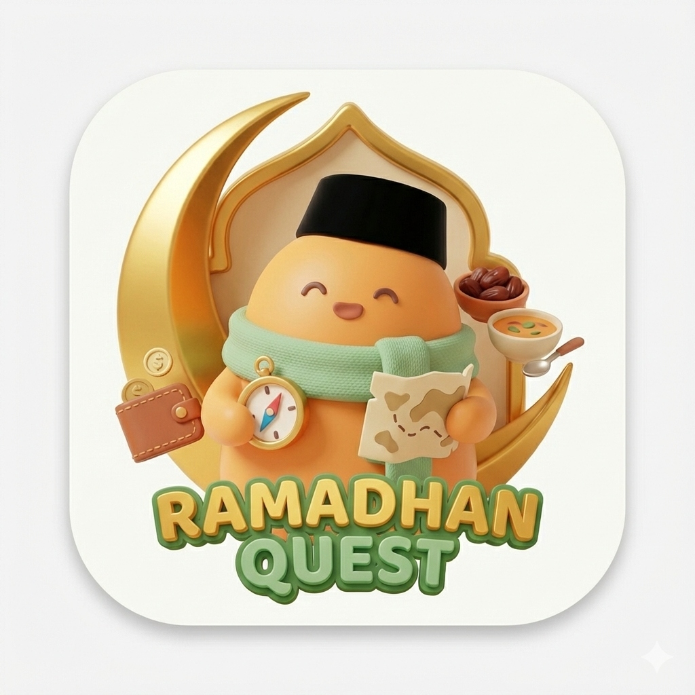

# 🌙 Ramadan Quest - Project Status & Roadmap

## 📊 Current Status (Week 1 Complete)

We have successfully initialized the **Ramadan Quest PWA**, a gamified companion app for Ramadan. The foundation is built using **Vue 3, Vite, Tailwind CSS, and Pinia**.

### ✅ Completed Features
1.  **Project Architecture**
    *   Set up Mobile-First PWA structure (Max-width 430px).
    *   Integrated **Pinia** for state management with `LocalStorage` persistence.
    *   Configured **Tailwind CSS** with a semantic color palette (Islamic Green, Warm Gray, Gold).

2.  **Core Logic (Stores & Composables)**
    *   **Game Engine:** Tracks XP, Level, Energy (Faidth), Coins, and Streak.
    *   **Wallet:** Logic for THR budgeting and suggested allocations.
    *   **Kitchen:** Recipe filtering (Sahur/Buka) and details from static JSON.
    *   **Habit Tracker:** Daily quest system with checklist logic.

3.  **User Interface (MVP)**
    *   **Home Dashboard:** Bento-grid style layout with Character Status, Daily Quests, and Quick Actions.
    *   **Kitchen Page:** Searchable recipe list with "Cook" action placeholders.
    *   **Wallet Page:** Interactive THR budget input and allocation visualization.
    *   **Profile Page:** User stats (XP/Coins) and settings.

4.  **Data**
    *   Integrated ~40 static recipes for Sahur and Buka (`recipes.json`).

---

## 🗺️ Next Steps: Week 2 (Core Features)

The focus for the upcoming week is to deepen the mechanics and interactions.

### 1. Habit Tracker (Deep Dive)
*   [x] Expand the Home widget into a full **Habit Page**.
*   [x] Add categories: Spiritual (Sholat, Tilawah) vs Social (Sedekah).
*   [x] Implement **XP Reward Animations** when checking off habits.

### 2. Kitchen & Cooking Mechanism
*   [x] Connect "Masak" (Cook) button to Game State (Restore Energy/Mood).
*   [x] Create a **Recipe Detail Modal** showing ingredients and steps.
*   [x] *Monetization Logic:* Add "Beli Bahan" button (Affiliate link placeholder).

### 3. Wallet & THR Manager
*   [x] Implement **"Pecahan Uang" (Money Breaker)** logic to help users organize physical cash.
*   [x] Add "Tabung" feature: Converting budget savings into Game Coins.

### 4. Game Integration
*   [x] **Level Up System:** Visual feedback when XP threshold is reached.
*   [x] **Streak System:** Logic to reset streak if user is inactive.
*   [ ] **Character States:** Dynamic emoji changes based on Energy/Mood (Sleepy, Happy, Energetic).

---

## 🛠️ Technical Stack
*   **Framework:** Vue 3 + TypeScript
*   **Build Tool:** Vite
*   **Styling:** Tailwind CSS
*   **State:** Pinia
*   **PWA:** vite-plugin-pwa
