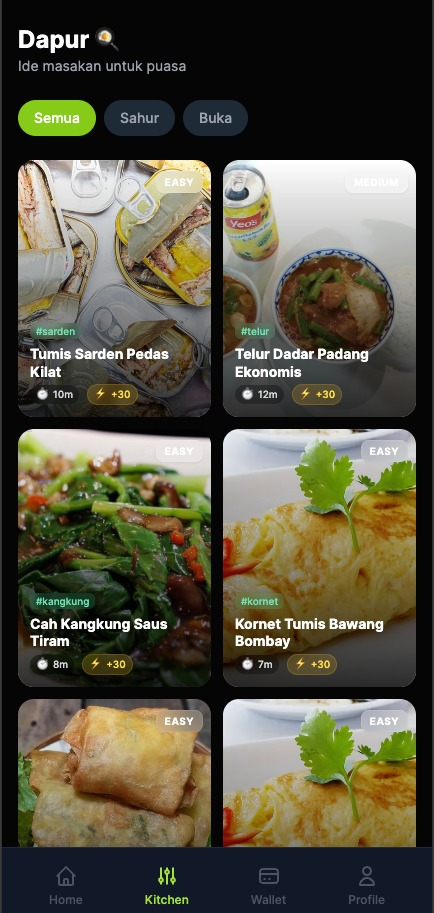

# 🌙 Ramadhan Quest

[](https://vuejs.org/)
[](https://vitejs.dev/)
[](https://tailwindcss.com/)
[](https://pinia.vuejs.org/)

**Ramadhan Quest** is a gamified Progressive Web App (PWA) designed to make your Ramadhan worship more engaging, consistent, and fun. Track your daily habits, manage your budget, unlock recipes, and earn achievements—all in one beautiful app.

---

## ✨ Features

### 🏠 Dashboard (Home)
Your central command center for Ramadhan.
- **Quick Logging:** Easily tap to log your Water intake (during non-fasting hours) and fast-track your worship.
- **Prayer Times:** Accurate prayer times (Adhan) based on your location.
- **Fasting Mode:** Smart UI that changes based on whether you are currently fasting.

<div align="center">
  
  <p><em>Home Dashboard with Quick Actions</em></p>
</div>

### 🍳 Kitchen (Resep Buka Puasa)
Discover delicious ideas for Iftar and Sahur.
- **50+ Recipes:** A curated list of recipes from Takjil to Main Courses.
- **Visual Delight:** Beautiful food photography using high-quality sources.
- **Unlockable Content:** (Future) Unlock special recipes as you level up!

<div align="center">
  
</div>

### 💰 Wallet (Tabungan Ramadhan)
Manage your finances wisely during the holy month.
- **Budget Allocations:** Smart breakdown for Zakat, Sedekah, Eid Shopping, and more.
- **Visual Money Breaker:** See where your money is going at a glance.
- **Savings Tracker:** keep your financial goals on track.

<div align="center">
  
</div>

### 🏆 Trophy Room (Gamification)
Stay motivated with our leveling and badge system.
- **XP System:** Earn XP for every good deed—prayer, water, sedekah.
- **Badges:** Unlock unique badges like "Hydration Master", "Pejuang Sahur", and "Istiqomah".
- **Interactive Details:** Tap any badge to see how to unlock it!

<div align="center">
  
</div>

---

## 🛠️ Technology Stack

- **Framework:** [Vue 3](https://vuejs.org/) (Composition API)
- **Build Tool:** [Vite](https://vitejs.dev/)
- **Styling:** [Tailwind CSS](https://tailwindcss.com/)
- **State Management:** [Pinia](https://pinia.vuejs.org/)
- **Persistence:** [VueUse](https://vueuse.org/) (Local Storage)
- **Icons & UI:** Custom SVGs, `vue-sonner` (Toasts)
- **PWA:** Vite PWA Plugin (Installable on iOS/Android)

---

## 🚀 Getting Started

### Prerequisites
- Node.js (v18+ recommended)
- npm or pnpm

### Installation

1.  **Clone the repository**
    ```bash
    git clone https://github.com/dwicaksono/ramadhan-quest.git
    cd ramadhan-quest
    ```

2.  **Install dependencies**
    ```bash
    npm install
    # or
    pnpm install
    ```

3.  **Run Development Server**
    ```bash
    npm run dev
    ```
    Open `http://localhost:5173` to view it in the browser.

4.  **Audio Setup**
    Ensure you place your SFX files in `public/audio/`:
    - `click.mp3`
    - `success.mp3`
    - `levelup.mp3`
    - `cook.mp3`

---

## 🤝 Support the Developer

If you enjoy using Ramadhan Quest, confirm us a coffee (or Tajkil)!

<a href="https://www.buymeacoffee.com/dwicaksono" target="_blank">
  
</a>

---

Made with ❤️ by **MuslimDev** | Ramadhan 1446H
