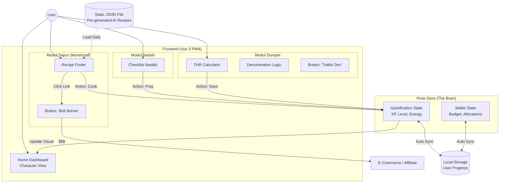

Tentu! Ini adalah langkah yang sangat bijak. Memiliki dokumen perencanaan (*Blue Print*) yang solid sebelum menulis satu baris kode pun akan menyelamatkan banyak waktu kita nanti.

Berikut adalah **Rangkuman Lengkap "Ramadan Quest" Project**, yang telah diperbarui dengan strategi data statis dan monetisasi.

---

# 🌙 Blue Print: Ramadan Quest (PWA MVP)

### 1. Konsep Utama

Aplikasi PWA "Super App" mini untuk menemani ibadah puasa yang menggabungkan produktivitas, manajemen keuangan, dan permainan virtual (Gamifikasi).

* **Platform:** Web-based PWA (Installable).
* **Tech Stack:** Vue 3, Vite, Tailwind CSS, Pinia (State), Vite PWA Plugin.
* **Target User:** Gen Z & Millennial (Anak kos, pekerja muda, ibu muda).
* **Vibe Design:** Modern Islamic Minimalist (*Bento Grid Style*).

---

### 2. User Journey (Alur Cerita Pengguna)

1. **Onboarding (H-1 Ramadhan):**
* User membuka web -> Install ke Home Screen.
* Input Nama & Target Budget THR.
* Karakter "Tamagochi" lahir (Status: Happy).

2. **Waktu Sahur (03:00 AM):**
* User buka fitur **Dapur**.
* Input bahan sisa di kulkas -> Muncul resep simpel.
* *Monetisasi:* User klik link afiliasi untuk beli Kecap/Bumbu yang habis.
* User klik "Selesai Masak" -> Karakter dapat **Energy**.

3. **Sepanjang Hari (07:00 - 17:00):**
* User buka fitur **Habit Tracker**.
* Centang Sholat/Ngaji -> Karakter dapat **XP (Experience Points)**.
* Jika lupa buka aplikasi seharian -> Karakter terlihat lemas/sedih.

4. **Menjelang Lebaran (H-7):**
* User buka fitur **Dompet**.
* Hitung alokasi THR & pecahan uang.
* User menyisihkan uang -> Dapat **Coins** untuk beli baju baru bagi karakter virtualnya.

---

### 3. Arsitektur Aplikasi & Alur Data (Flow Chart)

Berikut diagram alur yang mencakup sistem Data Statis (JSON) dan Monetisasi:

---

### 4. Strategi Teknis & Bisnis

#### **A. Manajemen Data (Cost: Rp 0)**

* **Metode:** *Pre-generated Content.*
* **Eksekusi:** Kita gunakan AI sekarang untuk membuat 30-50 resep sahur/buka fix. Disimpan dalam file `recipes.json`. Tidak ada panggilan API ke server saat user memakai aplikasi.

#### **B. Monetisasi (Low Intrusive)**

1. **Affiliate Marketing:** Di dalam detail resep (JSON), kita sisipkan link produk (Shopee/Tokopedia) pada bahan-bahan utama.
2. **Support Button:** Tombol "Saweria/Trakteer" di menu Setting/Profile untuk donasi sukarela.

#### **C. Strategi Desain**

* Menggunakan AI (Midjourney/Dall-E) untuk aset karakter 3D lucu.
* Menggunakan Tailwind CSS untuk UI yang bersih tanpa perlu *custom CSS* yang berat.

---

### 5. Roadmap Pengerjaan (Timeline 4 Minggu)

| Minggu | Fokus Utama | Detail Aktivitas |
| --- | --- | --- |
| **Minggu 1** | **Setup & Logic** | • Init Vue 3 + Vite + Tailwind. 

 • Setup Pinia Store (State Game). 

 • **Generate Data Resep (JSON) + Link Affiliate.** |
| **Minggu 2** | **Fitur Core** | • Coding Modul Dapur (Filter Logic). 

 • Coding Modul Dompet (Logic Pecahan Uang). 

 • Integrasi Logic Game (XP/Energy). |
| **Minggu 3** | **UI & Assets** | • Generate Aset Karakter (AI). 

 • Styling UI (Bento Grid). 

 • Implementasi Animasi Sederhana (CSS). |
| **Minggu 4** | **PWA & Launch** | • Setup Manifest PWA (Icon, Splash Screen). 

 • Testing Offline Mode. 

 • Deploy ke Vercel/Netlify. |

---
