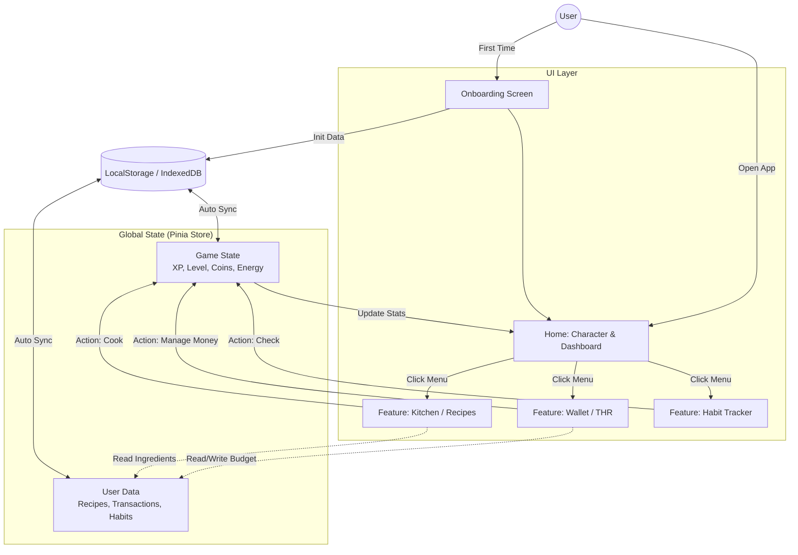

Tentu, mari kita susun rencana perangnya ("Battle Plan")! Karena kamu seorang Software Engineer, saya akan buat detailnya teknis dan terstruktur.

### 1. Rekomendasi Tech Stack untuk PWA MVP

Untuk kasus **MVP yang harus cepat rilis (deadline bulan puasa)** dan sifatnya **Client-Side Heavy** (logika ada di browser, bukan server), berikut analisis saya:

* **Nuxt (Vue Meta-Framework):**
* *Verdict:* **Skip dulu.** Nuxt sangat powerful untuk SEO dan SSR, tapi untuk aplikasi utilitas yang tertutup (user-centric dashboard) dan MVP, Nuxt menambah lapisan kompleksitas yang tidak perlu.

* **React + Vite:**
* *Verdict:* **Sangat Bagus.** Ekosistem library paling luas. Jika kamu sudah nyaman dengan React Hooks, ini pilihan aman.

* **Vue 3 + Vite:**
* *Verdict:* **Pemenang untuk MVP ini.**
* *Alasan:* Vue 3 (Composition API) dengan Vite sangat ringan. Kurva belajarnya lebih landai untuk styling cepat. Reactivity system Vue (Ref/Reactive) sangat intuitif untuk kasus "Tamagochi" dimana perubahan state (misal: Health Bar) harus *instant* terefleksi di UI.

**Rekomendasi Utama Saya:** Gunakan **Vue 3 + Vite + Pinia (State Management)**.

* *Bundle size* lebih kecil (penting untuk PWA di sinyal buruk).
* Setup PWA dengan `vite-plugin-pwa` sangat *seamless*.

---

### 2. App Flow (User Journey)

Aplikasi ini menggunakan konsep **"Hub & Spoke"**. Halaman Home (Tamagochi) adalah pusatnya, fitur lain adalah cabangnya.

1. **Onboarding (First Open):**
* User set nama karakter & target budget THR.
* Data disimpan ke `localStorage`.

2. **Home (Dashboard/Tamagochi):**
* Melihat status Karakter (Lapar? Senang?).
* Melihat ringkasan "Misi Hari Ini" (Sahur, Sholat).

3. **Action Loops (Looping Aktivitas):**
* *Loop Dapur:* User klik Dapur -> Pilih Bahan -> Masak -> **Dapat XP & Energy**.
* *Loop Ibadah:* User klik Checklist -> Centang Sholat -> **Dapat XP & Happiness**.
* *Loop Dompet:* User klik Dompet -> Catat Alokasi THR -> **Dapat Coins** (untuk beli skin/baju karakter).

4. **End Game (Lebaran):**
* Saat tanggal 1 Syawal, aplikasi menampilkan "Rapor Ramadhan" (Total XP, Sisa THR) dan ucapan selamat.

---

### 3. Architecture Diagram (Mermaid Chart)

Berikut adalah visualisasi aliran data dan navigasi aplikasinya. Kamu bisa copy kode ini ke editor Mermaid jika ingin melihat versi live-nya.

---

### 4. Roadmap Pengerjaan (4 Minggu)

Asumsi kita mulai minggu ini, target rilis H-3 sebelum puasa.

#### **Minggu 1: The Skeleton (Core Logic & Setup)**

* **Hari 1-2:** Setup Project (Vue/React + Vite), install Tailwind, setup `vite-plugin-pwa`.
* **Hari 3-4:** Setup State Management (Pinia/Zustand). Buat struktur data JSON untuk Resep dan Habit.
* **Hari 5-7:** Membuat **Logic Inti** tanpa UI bagus.
* *Test:* Fungsi filter resep.
* *Test:* Fungsi kalkulator pecahan uang.
* *Test:* Fungsi leveling (XP bertambah).

#### **Minggu 2: The Features (UI/UX Implementation)**

* **Hari 1-3:** Implementasi UI **Modul Dapur** & **Modul Dompet**. Fokus fungsionalitas.
* **Hari 4-6:** Implementasi UI **Modul Habit/Gamifikasi**.
* **Hari 7:** Integrasi antar modul. Pastikan saat "Masak" diklik, "Energi" di Home bertambah.

#### **Minggu 3: The Polish (Gamifikasi & Assets)**

* **Hari 1-3:** Masukkan aset visual.
* Cari/buat ikon lucu (atau pakai emoji dulu untuk MVP).
* Buat sprite sederhana untuk karakter (bisa berupa SVG statis yang berubah ekspresi: senyum, cemberut).

* **Hari 4-5:** **PWA Configuration**.
* Bikin icon 192x192, 512x512.
* Test "Add to Home Screen".
* Test mode offline (matikan wifi, apakah app masih jalan?).

#### **Minggu 4: Deploy & Share**

* **Hari 1-2:** Bug fixing & Cleaning code.
* **Hari 3:** Deploy ke **Vercel/Netlify** (Gratis & Support HTTPS otomatis untuk PWA).
* **Hari 4:** Sebar link ke teman-teman/sosmed untuk testing awal.

---

### Pertanyaan Sebelum Kita Mulai Coding:

Untuk memastikan saya memberikan snippet kode yang tepat di langkah selanjutnya:

1. **Keputusan Akhir:** Apakah kita kunci di **Vue 3** atau kamu lebih nyaman tetap di **React**? (Saya bisa support keduanya).
2. **Asset Visual:** Apakah kamu punya kemampuan desain (Figma/Adobe)? Atau kita mau pakai style **"Minimalist/Brutalist"** yang hanya main typography dan warna solid (biar tidak pusing mikirin gambar)?
3. **Data Resep:** Apakah kamu mau kita *generate* dummy data resep pakai AI nanti, atau kamu mau input manual resep favoritmu?
